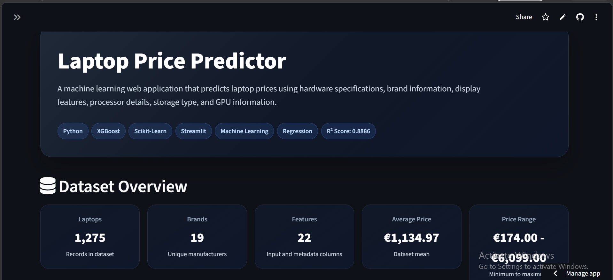
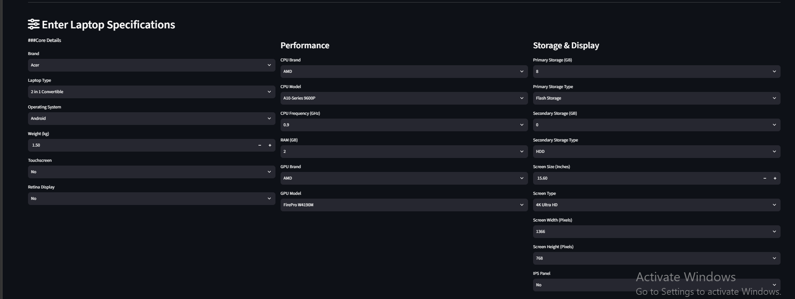
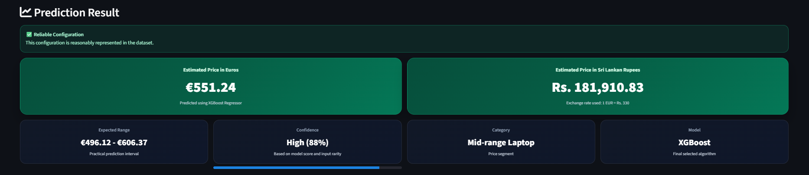
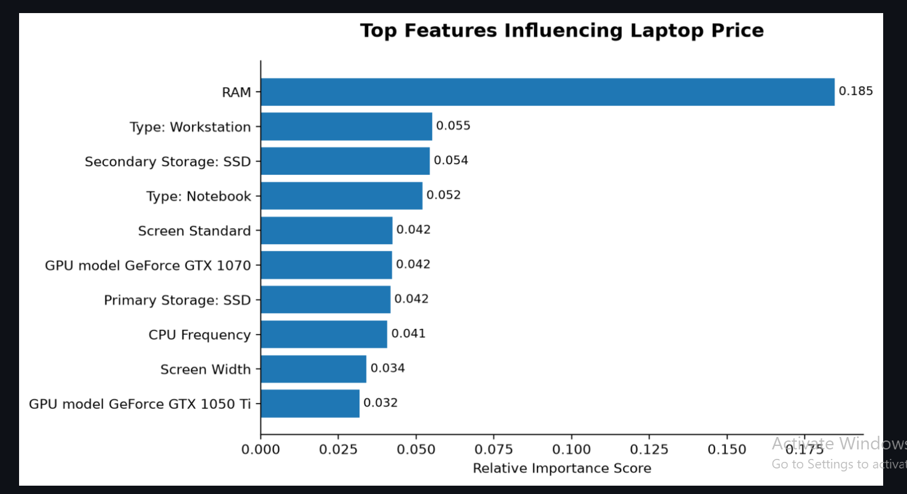
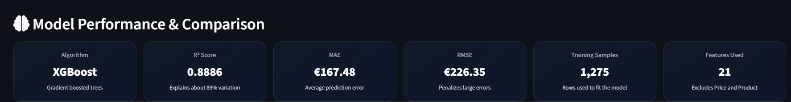
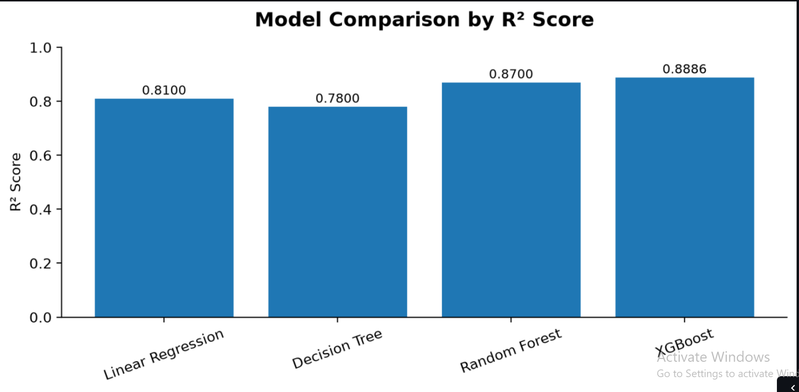

# 💻 Laptop Price Predictor

A machine learning web application that predicts laptop prices using hardware specifications. The application is powered by **XGBoost Regression**, developed with **Python**, and deployed using **Streamlit Community Cloud**.


---

# 🌐 Live Demo

**Try the application here**

👉 https://laptop-price-predictor-ingc6bzxbrkwcfgcbxjfzg.streamlit.app/

---

# 📖 Project Overview

Laptop prices depend on multiple hardware characteristics such as processor, RAM, storage configuration, GPU, display specifications, operating system, and manufacturer.

This project demonstrates a complete **Machine Learning workflow**, beginning with data analysis and preprocessing, followed by model training, evaluation, deployment, and UI development.

The final model predicts laptop prices based on user-selected hardware specifications through an interactive Streamlit web application.

---

# ✨ Features

- 💻 Laptop price prediction
- 🌍 Display price in **Euros (€)** and **Sri Lankan Rupees (LKR)**
- 📊 Dataset overview
- 📈 Feature importance visualization
- 🤖 Model comparison
- 🔍 Similar laptops from the dataset
- ⚠ Hardware reliability warnings
- 🌙 Modern dark UI
- ☁ Cloud deployment using Streamlit

---

# 📊 Dataset

**Source**

Laptop Price Dataset (Kaggle)

https://www.kaggle.com/datasets/ionaskel/laptop-prices

| Property  | Value |
|-----------|------:|
| Records   | 1275 |
| Features  | 22 |
| Target    | Price (Euros) |

---

# 🧹 Data Preprocessing

The dataset was prepared using the following steps:

- Checked missing values
- Cleaned numerical columns
- Encoded categorical variables
- Feature selection
- Exploratory Data Analysis (EDA)
- Data visualization
- Model-ready preprocessing pipeline

---

# 🤖 Machine Learning Models

Multiple regression algorithms were evaluated.

| Model             | R² Score |
|------------------ |----------:|
| Linear Regression | 0.81 |
| Decision Tree     | 0.78 |
| Random Forest     | 0.87 |
| **XGBoost**       | **0.8886** |

### Final Selected Model

**XGBoost Regressor**

Performance

- **R² Score:** 0.8886
- **MAE:** €167.48
- **RMSE:** €226.35

XGBoost produced the highest prediction accuracy while maintaining good generalization performance.

---

# ⚙ Machine Learning Workflow

```
Dataset
      │
      ▼
Data Cleaning
      │
      ▼
Feature Engineering
      │
      ▼
Exploratory Data Analysis
      │
      ▼
Encoding
      │
      ▼
Model Training
      │
      ▼
Model Comparison
      │
      ▼
Model Evaluation
      │
      ▼
XGBoost Selection
      │
      ▼
Streamlit Deployment
```

---

# 📸 Application Preview

## 🏠 Home Page



---

## ⚙ Input Form



---

## 🎯 Prediction Result



---

## 📈 Feature Importance



---

## 📊 Model Performance



---

## 📉 Model Comparison



---

# 🛠 Technologies Used

### Programming

- Python

### Data Analysis

- Pandas
- NumPy

### Machine Learning

- Scikit-Learn
- XGBoost

### Visualization

- Matplotlib

### Deployment

- Streamlit

### Version Control

- Git
- GitHub

---

# 📁 Project Structure

```
laptop-price-predictor/
│
├── data/
├── images/
├── app.py
├── EDA.ipynb
├── model.pkl
├── df.pkl
├── requirements.txt
└── README.md
```

---

# 🚀 Installation

Clone the repository

```bash
git clone https://github.com/DinushiSenarath/laptop-price-predictor.git
```

Move into the project

```bash
cd laptop-price-predictor
```

Create virtual environment

```bash
conda create -n laptop_env python=3.11
```

Activate

```bash
conda activate laptop_env
```

Install dependencies

```bash
pip install -r requirements.txt
```

Run the application

```bash
streamlit run app.py
```

---

# 💡 Future Improvements

- Hyperparameter tuning
- SHAP explainability
- REST API
- Docker support
- CI/CD pipeline
- User authentication
- Price trend analysis

---

# 👩‍💻 Author

**Dinushi Senarath**

 Computer Engineering Undergraduate

University of Jaffna

**GitHub**

https://github.com/DinushiSenarath

**LinkedIn**

www.linkedin.com/in/dinushi-senarath-65643934b

---

